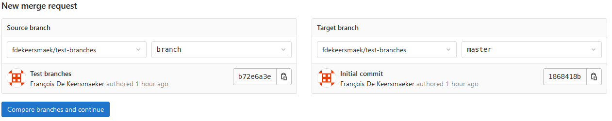

.. -*- coding: utf-8 -*-
.. Copyright |copy| 2013 by Benoit Legat
.. Ce fichier est distribué sous une licence `creative commons <http://creativecommons.org/licenses/by-sa/3.0/>`_

.. spelling::
   kernel
   commits
   fork
   committé
   committées
   respécifier
   l'email
   email
   GitHub
   remote
   push
   pusher
   pushé
   staging
   area
   committer
   snapshot
   noeud
   noeuds
   staging
   Staging
   committons
   Committons
   committés
   Branching
   request
   committait
   check
   backtrace
   git
   Alice
   Git
   tag
   tags
   patch
   master
   logarithmique
   Ruby
   cliquez
   cliquer

.. _git-ref:

Git
---
.. sectionauthor:: Benoit Legat

`git(1)`_ est un outil de **version control**, c'est-à-dire de gestion de code sous formes de versions.
Il est utilisé pour sauvegarder chaque version d'un code source,
depuis sa création jusqu'à la dernière version.
Il est également très utile dans le cas où plusieurs programmeurs travaillent sur le même projet,
car il permet de fusionner les modifications apportées par chaque membre de l'équipe
et d'éviter les conflits de code, par exemple un fichier qui aurait été modifié conjointement
par 2 personnes.
Il est extrêmement utilisé en pratique, et permet de faciliter grandement
la gestion du code source lors de projets de taille relativement grande,
ou comprenant plusieurs programmeurs.

`git(1)`_ a été développé initialement pour la gestion du code source du kernel Linux.
Il est aussi utilisé pour la gestion des sources de ce document
depuis https://github.com/obonaventure/SyllabusC.
On l'utilise le plus souvent à l'aide de l'utilitaire `git(1)`_ mais il
existe aussi des
`applications graphiques <http://git-scm.com/downloads/guis>`_.

Le code source est sauvegardé dans un *dépôt*, ou *repository*, qui est simplement
un dossier contenant le code, et auquel chaque développeur a accès.
Ce repository contient un historique de toutes les versions du code,
depuis sa création.
Chacune des différentes versions est enregistrée dans un *commit*,
qui représente les modifications apportées aux différents fichiers du projet
depuis la version précédente.
On sait ainsi facilement voir ce qui a changé entre deux versions (pas spécialement
une version et la suivante) et même restaurer l'état de certains
fichiers à une version sauvegardée dans un commit.  Du coup, si vous
utilisez `git(1)`_ pour un projet, vous ne pouvez jamais perdre plus
que les changements que vous n'avez pas encore committé.  Toutes les
versions du codes déjà committées sont sauvegardées et facilement
accessibles.  Cette garantie est extrêmement précieuse et constitue à
elle seule une raison suffisante d'utiliser `git(1)`_ pour tous vos
projets.

`git(1)`_ est souvent utilisé conjointement avec une plateforme en ligne,
comme `GitHub <https://github.com>`_ ou GitLab (via la `Forge UCLouvain <https://forge.uclouvain.be/>`_),
qui permet de centraliser le code source, pour que tous les collaborateurs
puissent récupérer la dernière version, et qui permet également de consulter
le code source en ligne.

Configuration de l'utilisateur
~~~~~~~~~~~~~~~~~~~~~~~~~~~~~~

Lorsqu'on utilise `git(1)`_, chaque commit est documenté en fournissant le nom de l'auteur,
son email, un commentaire et une description (optionnelle).
Pour ne pas devoir spécifier le nom et l'email à chaque fois,
il est possible de configurer `git(1)`_ pour qu'il les stocke et les utilise pour chaque commit.
Pour ce faire, il suffit d'utiliser la commande `git-config(1)`_:

.. code-block:: bash

  $ git config --global user.name "Your name"
  $ git config --global user.email name@domain.com

L'option ``--global`` signifie que ces données seront utilisées pour chaque repository
sur la machine. En enlevant l'option, les données seront donc uniquement utilisées
pour le repository courant.

Création d'un repository
~~~~~~~~~~~~~~~~~~~~~~~~

La première étape pour profiter des capacités de `git(1)`_ pour un projet,
est de créer un repository qui contiendra le code source du projet.
La façon la plus simple de faire est de créer le repository depuis la plateforme en ligne (GitHub ou GitLab),
puis le cloner en local.
Pour ce faire, la première étape est de créer le repository sur la plateforme en ligne.
Cela est relativement simple et ne sera pas décrit dans ce document.
Ce repository sera appelé *remote*, car il n'est pas situé en local, mais sur
un serveur distant accessible depuis l'Internet, ce qui permet à chaque
utilisateur de le consulter pour obtenir la dernière version du code source.
Une fois créé, il faut récupérer le lien du repository sur la page web du projet.
Le lien peut être sous forme HTTPS ou SSH.
Le premier est le choix de base, et le second est choisi pour utiliser une clé ssh
pour s'identifier (voir la section :ref:`outils:ssh` du syllabus pour plus d'informations).
Ensuite, il faut *cloner* le repository en local, avec la commande `git-clone(1)`_:

.. code-block:: bash

  $ git clone LIEN_DU_REPOSITORY
  Cloning into 'NOM_DU_REPOSITORY'...

Cette commande va cloner le repository dans le dossier courant,
de manière à avoir une copie locale du code source sur laquelle travailler.

Utilisation linéaire de Git
~~~~~~~~~~~~~~~~~~~~~~~~~~~

La manière la plus simple d'utiliser `git(1)`_ est de façon linéaire,
c'est-à-dire que chaque version du code (chaque commit) sera une modification de la précédente,
par addition, modification, ou suppression de fichiers.
Dans ce cas, après la création du repository contenant le projet,
le travail sur le code source suit un schéma,
qui est répété pour chaque modification, et qui est le suivant:

  * Récupération du dernier commit (``git pull``)
  * Modification du code source
  * Ajout des modifications au commit (``git add``)
  * Sauvegarde du commit (``git commit``)
  * Publication des changements sur le remote (``git push``)

Chacune de ces étapes sera décrite ci-après.

Récupération du dernier commit
##############################

Avant de travailler sur le code, il faut récupérer en local toutes les modifications
qui auraient été apportées au remote entre temps.
En effet, si on ne récupère pas ces modifications,
des conflits peuvent apparaître, car des fichiers auraient été modifiées
en même temps dans deux copies du repository.

Pour récupérer la dernière version du remote, il suffit d'exécuter la commande `git-pull(1)`_:

.. code-block:: bash

  $ git pull

Cette commande va appliquer les derniers commits du remote à la copie locale du repository.
Ensuite, on peux travailler sur le code et modifier les fichiers.

Ajout des modifications au commit
#################################

Lorsque des modifications ont été apportées au code, et qu'on veut les publier sur le remote
pour que tous les développeurs aient accès à la dernière version,
la première étape est de créer un commit contenant ces modifications.

Imaginons que le repository contient un fichier ``main.c``
(qui calcule la somme des entiers de 0 à n) qui a été modifié.
On peut voir les fichiers qui ont été modifiés avec la commande `git-status(1)`_:

.. code-block:: bash

  $ git status
  # On branch master
  # Changes not staged for commit:
  #   (use "git add <file>..." to update what will be committed)
  #   (use "git checkout -- <file>..." to discard changes in working directory)
  #
  #	modified:   main.c
  #
  no changes added to commit (use "git add" and/or "git commit -a")

Avec `git-diff(1)`_, on peut voir quelles sont les lignes qui ont été
retirées (elles commencent par un ``-``) et celles qui ont été ajoutées
(elles commencent par un ``+``).

.. code-block:: diff

   $ git diff
   diff --git a/main.c b/main.c
   index 86601ed..a9e4c4a 100644
   --- a/main.c
   +++ b/main.c
   @@ -2,7 +2,12 @@
    #include <stdlib.h>

    int main (int argc, char *argv[]) {
   -  long int sum = 0, i, n = 42;
   +  long int sum = 0, i, n;
   +  char *end = NULL;
   +  n = strtol(argv[1], &end, 10);
   +  if (*end != '\0') {
   +    return EXIT_FAILURE;
   +  }
      for (i = 1; i <= n; i++) {
        sum += i;
      }

Si les modifications nous conviennent, il suffit ensuite d'ajouter les fichiers
modifiés au commit, avec la commande `git-add(1)`_:

.. code-block:: bash

  $ git add main.c

Il est également possible d'ajouter d'un coup tous les fichiers modifiés au commit
en utilisant l'option ``--all`` de `git-add(1)`_:

.. code-block:: bash

  $ git add --all

Le commit a été crée, il faut maintenant le sauvegarder, puis le publier sur le remote.

Sauvegarde du commit
####################

Une fois que le commit a été crée, il faut le sauvegarder,
pour indiquer au repository qu'on est passé à une nouvelle version.
Pour ce faire, on utilise la commande `git-commit(1)`_:

.. code-block:: bash

  $ git commit

Cette commande va ouvrir un éditeur de texte pour indiquer un message
décrivant le commit.
Par défaut, l'éditeur est `vim(1)`_.
Il s'agit d'un éditeur en ligne de commande, puissant mais très compliqué à utiliser pour les débutants.
Il est possible de modifier l'éditeur par défaut en utilisant la commande `git-config(1)`_,
déjà mentionnée plus haut.
Un autre éditeur en ligne de commande, plus simple d'utilisation, est `nano(1)`_.
Pour choisir `nano(1)`_ comme éditeur par défaut, il suffit d'exécuter la commande suivante:

.. code-block:: bash

  $ git config --global core.editor nano

Cependant, ouvrir un éditeur de texte à chaque commit peut vite devenir laborieux.
En utilisant l'option ``-m`` de `git-commit(1)`_, il est possible de spécifier le message
décrivant le commit directement lors de l'appel à la commande `git-commit(1)`_:

.. code-block:: bash

  $ git commit -m "Commit message"
  [master 56ce59c] Commit message
   1 file changed, 6 insertions(+), 1 deletion(-)

Parmi les options de `git-commit(1)`_, il existe aussi l'option ``-a`` qui peut s'avérer très utile.
Cette option permet d'ajouter directement, lors de l'appel à `git-commit(1)`_,
toutes les modifications qui auraient été apportées à des fichiers
**déjà enregistrés dans le repository**.
Si de nouveaux fichiers ont été créés, l'option ``-a`` ne les prendra pas en compte,
et il faudra alors passer par la commande `git-add(1)`_.

Il est finalement possible de combiner les options ``-m`` et ``-a``, en utilisant l'option ``-am``.
Cette option permet donc, en une seule commande, d'ajouter toutes les modifications
apportées aux fichiers déjà suivis, et de préciser le message du commit, de la façon suivante:

.. code-block:: bash

  $ git commit -am "Commit message"
  [master 56ce59c] Commit message
   1 file changed, 6 insertions(+), 1 deletion(-)

Il est alors possible de voir le nouveau commit dans l'historique du repository,
en utilisant la commande `git-log(1)`_:

.. code-block:: bash

   $ git log
   commit 56ce59c54726399c18b3f87ee23a45cf0d7f015d
   Author: Benoît Legat <benoit.legat@gmail.com>
   Date:   Sun Aug 25 15:37:51 2013 +0200

       Commit message

   commit 3d18efe4df441ebe7eb2b8d0b78832a3861dc05f
   Author: Benoît Legat <benoit.legat@gmail.com>
   Date:   Sun Aug 25 15:32:42 2013 +0200

       First commit

Une fois que le commit a été enregistré, il reste à le publier sur le remote,
pour que tous les développeurs du projet y aient accès.

Publication du commit sur le remote
###################################

Pour que tous les développeurs soient en mesure de voir les dernières modifications
qui auraient été apportées en local, il faut que chaque développeur,
après avoir créé et enregistré un commit, le publie sur le remote,
qui est accessible par tous les développeurs via l'Internet.
Pour ce faire, on utilise la commande `git-push(1)`_:

.. code-block:: bash

   $ git push
   Counting objects: 5, done.
   Delta compression using up to 4 threads.
   Compressing objects: 100% (2/2), done.
   Writing objects: 100% (3/3), 291 bytes, done.
   Total 3 (delta 1), reused 0 (delta 0)
   To github.com:user/projectname.git
      80507e3..205842a  master -> master

De cette manière, chaque développeur qui voudrait à son tour apporter des modifications au projet,
peut appliquer les mêmes étapes, et le remote contiendra toujours la dernière version du code.
En résumé, les étapes sont:

  * ``git pull``
  * Modification du code
  * ``git add``
  * ``git commit``
  * ``git push``

Résolution de conflits
######################

Lorsque plusieurs développeurs travaillent sur un même projet, il est possible qu'il
apportent des modifications au code en même temps.
Dans ce cas, pour le second développeur voulant *push* ses modifications,
le *push* sera rejeté:

.. code-block:: bash

   $ git push
   To github.com:user/projectname.git
    ! [rejected]        master -> master (non-fast-forward)
   error: failed to push some refs to 'github.com:user/projectname.git'
   hint: Updates were rejected because the tip of your current branch is behind
   hint: its remote counterpart. Merge the remote changes (e.g. 'git pull')
   hint: before pushing again.
   hint: See the 'Note about fast-forwards' in 'git push --help' for details.

Cela est dû a fait que le remote a été modifié entre temps par un autre développeur,
et donc que le dernier commit n'est pas le même sur le repository local et le remote.

Pour régler ce problème, on commence par faire un ``git pull``.
Deux cas de figure peuvent alors apparaître.
Le premier cas, le plus simple, arrive lorsque les deux développeurs ont modifié des fichiers différents.
Dans ce cas, le ``pull`` va réussir à fusionner les deux versions du repository,
et produire un *merge* (une fusion).
Un éditeur de texte s'ouvrira pour indiquer un message relatif au merge,
et une fois ce message écrit, le *merge* sera effectué:

.. code-block:: bash

  $ git pull
  remote: Enumerating objects: 4, done.
  remote: Counting objects: 100% (4/4), done.
  remote: Total 4 (delta 3), reused 4 (delta 3), pack-reused 0
  Unpacking objects: 100% (4/4), done.
  From github.com:user/projectname
     4d38eb9..617618b  master     -> origin/master
  Merge made by the 'recursive' strategy.
   main.c | 3 +++
   1 file changed, 3 insertions(+)

Il ne reste plus qu'à faire un ``git push`` pour que le *merge* soit
publié sur le remote.

Le deuxième cas possible arrive lorsque les deux développeurs ont modifié le même fichier
(par exemple ``main.c``).
Dans ce cas, le ``git pull`` n'arrivera pas à *merge* automatiquement:

.. code-block:: bash

   $ git pull
   remote: Counting objects: 5, done.
   remote: Compressing objects: 100% (1/1), done.
   remote: Total 3 (delta 1), reused 3 (delta 1)
   Unpacking objects: 100% (3/3), done.
   From github.com:user/projectname
      80507e3..205842a  master     -> origin/master
   Auto-merging main.c
   CONFLICT (content): Merge conflict in main.c
   Automatic merge failed; fix conflicts and then commit the result.

`git(1)`_ marque alors dans le fichier ``main.c`` la ligne en conflit et ce qu'elle vaut
dans les deux commits:

.. code-block:: c

   #include <stdio.h>
   #include <stdlib.h>

   int main (int argc, char *argv[]) {
   <<<<<<< HEAD
     return EXIT_SUCCESS;
   =======
     return 0;
   >>>>>>> 205842aa400e4b95413ff0ed21cfb1b090a9ef28
   }

La ligne située entre le marqueur ``HEAD`` et la ligne de séparation
est la version présente en local,
tandis que la ligne située après la ligne de séparation est celle présente sur le remote.
Il est possible de retrouver quels sont les fichiers en conflit en utilisant `git-status(1)`_:

.. code-block:: bash

   $ git status
   # On branch master
   # You have unmerged paths.
   #   (fix conflicts and run "git commit")
   #
   # Unmerged paths:
   #   (use "git add <file>..." to mark resolution)
   #
   #	both modified:      main.c
   #
   no changes added to commit (use "git add" and/or "git commit -a")

Il suffit alors d'éditer le fichier en question, et de ne garder que le contenu voulu
dans le fichier:

.. code-block:: c

   #include <stdio.h>
   #include <stdlib.h>

   int main (int argc, char *argv[]) {
     return EXIT_SUCCESS;
   }

Il faut ensuite commit et push les modifications pour sauvegarder la fusion:

.. code-block:: bash

  $ git commit -am "Merge conflict"
  [master eede1c8] Merge conflict
  $ git push
  Counting objects: 8, done.
  Delta compression using up to 4 threads.
  Compressing objects: 100% (3/3), done.
  Writing objects: 100% (4/4), 478 bytes, done.
  Total 4 (delta 2), reused 0 (delta 0)
  To github.com:user/projectname.git
     205842a..eede1c8  master -> master

Le conflit sera alors résolu, et la dernière version du code sera disponible sur le remote.

Utilisation non-linéaire de Git
~~~~~~~~~~~~~~~~~~~~~~~~~~~~~~~

La puissance de `git(1)`_ vient du fait qu'il est possible de créer des historiques
non-linéaires, plus complexes que l'historique linéaire simple décrit jusqu'à présent.
Pour cela, on utilise le concept de *branches*,
qui représentent différentes modifications en parallèle du code source.

Branches
########

Un repository `git(1)`_ est divisé en *branches*, qui représentent des évolutions
différentes en parallèle du repository.
Chaque commit est appliqué sur une seule branche.
De cette manière, les branches sont une bonne manière de développer de nouvelles
fonctionnalités, sans compromettre une version fonctionnelle du code.

Lors de l'utilisation linéaire de `git(1)`_ décrite ci-dessus, toutes les modifications
apportées au code se faisaient sur une seule branche, la branche ``master``.
Il s'agit de la branche de base, sur laquelle toutes les modifications sont apportées,
si on ne créé pas explicitement de nouvelle branche.
De base, l'historique d'un repository est donc le suivant:

  .. figure:: ./figures/git/branch_init.png
    :align: center

    Historique initial d'un repository

Les commits sont représetés en bleu, et les branches en rouge.
L'indication ``HEAD`` représente l'état actuel du repository sur la copie locale.

Pour créer une nouvelle branche, on utilise la commande `git-branch(1)`_,
en spécifiant le nom de la nouvelle branche. On peut aussi utiliser cette commande
sans argument pour montrer toutes les branches existantes,
avec un symbole ``*`` pour indiquer la branche active (donc là où est situé le marqueur ``HEAD``):

.. code-block:: bash

  $ git branch branch_1
  $ git branch
    branch_1
  * master

L'historique est désormais le suivant:

  .. figure:: ./figures/git/branch_1.png
    :align: center

    Historique après création de ``branch_1``

Pour supprimer une branche, on utilise la commande `git-branch(1)`_,
avec l'option ``-d``, et en spécifiant le nom de la branche à supprimer:

.. code-block:: bash

  $ git branch -d branch_1
  $ git branch
  * master

La création d'une branche ne change pas la branche active,
ce qui signifie que les modifications apportées au code le seront toujours sur la branche ``master``.
Pour changer de branche active, il faut utiliser la commande `git-checkout(1)`_:

.. code-block:: bash

  $ git checkout branch_1
  Switched to branch 'branch_1'
  $ git branch
  * branch_1
    master

Avec cette commande, le pointeur ``HEAD`` a été modifié, et pointe maintenant vers la branche ``branch_1``.
Désormais, les modifications seront bien apportées sur la branche ``branch_1``.

Attention, lorsqu'on travaille sur une branche autre que ``master``, les simples commandes
``git push`` ou ``git pull`` ne fonctionneront pas.
A la place, il faut utiliser les commandes suivantes:

  * ``git push origin branch``
  * ``git pull origin branch``

Ces commandes fonctionnent également avec la branche ``master``, en remplaçant le nom
de la branche par ``master``.

Fusionner des branches
######################

En général, on utilise les branches pour développer de nouvelles fonctionnalités
sans risquer de compromettre la base fonctionnelle du code.
Lorsque la fonctionnalité est finie et est fonctionnelle,
on veut pouvoir fusionner la branche de base (``master``) avec la branche utilisée
pour développer la fonctionnalité (soit ``branch``),
en appliquant un *merge*.
Pour ce faire, il y a deux possibilités:

  * Utiliser l'interface web de la plateforme (GitLab ou GitHub).
    Cette possibilité est la plus simple.
  * Utiliser la ligne de commande.

Fusionner des branches depuis l'interface web
^^^^^^^^^^^^^^^^^^^^^^^^^^^^^^^^^^^^^^^^^^^^^

La première possibilité est très simple.
Un exemple sera donné ici avec GitLab, et est très similaire avec GitHub.
Tout d'abord, depuis la page du repository, aller sur la page "*Merge requests*"
("*Pull requests*" sur GitHub):

.. figure:: ./figures/git/merge_web/1.png
  :align: center
  :scale: 100

  Menu du repository sur GitLab

Créez une nouvelle *merge/pull request*.
Il faut ensuite choisir les branches *source* et *cible* (*target*).
La branche source sera celle avec la nouvelle fonctionnalité,
dans notre cas la branche ``branch``, tandis que la branche *cible*
sera la branche de base, dans notre cas la branche ``master``.

  Sélection des branches *source* et *cible*

Il est possible d'inclure une description à la *merge request*,
et de configurer plusieurs options, comme la personne qui doit s'occuper de la *merge request*,
ou le fait que la branche source sera supprimée ou pas après la fusion.
Une fois la *merge request* créée, s'il n'y a pas de conflit,
les branches peuvent être fusionnées automatiquement:

.. figure:: ./figures/git/merge_web/3.png
  :align: center
  :scale: 100

  Fusion automatique

Si les mêmes fichiers ont été modifiés sur les deux branches, il y a conflit,
et il est donc impossible de fusionner les branches automatiquement:

.. figure:: ./figures/git/merge_web/4.png
  :align: center
  :scale: 100

  Conflits lors de la fusion

Ces conflits peuvent être résolus directement depuis l'interface web,
ou en fusionnant les branches localement, puis en réglant les conflits
comme expliqué précédemment.

Fusionner des branches localement
^^^^^^^^^^^^^^^^^^^^^^^^^^^^^^^^^

Il est également possible de fusionner des branches localement,
en utilisant la ligne de commande.
Pour cela, on va utiliser la commande `git-merge(1)`_, depuis la branche cible (``master``),
pour la fusionner avec la branche source (``branch``).
Si il n'y a pas de conflit, la fusion est automatique:

.. code-block:: bash

  $ git merge branch
  Updating 1f939f3..62cf363
  Fast-forward
   branch.txt | 2 +-
   1 file changed, 1 insertion(+), 1 deletion(-)

Si les mêmes fichiers ont été modifiés sur les deux branches, il y a conflit,
et il faut donc résoudre ces conflits comme expliqué précédemment.
Ici, il y a conflit sur le fichier ``branch.txt``:

.. code-block:: bash

  $ git merge branch
  Auto-merging branch.txt
  CONFLICT (content): Merge conflict in branch.txt
  Automatic merge failed; fix conflicts and then commit the result.

Le fichier ``branch.txt`` a donc été marqué pour la résolution:

.. code-block:: text

  <<<<<<< HEAD
  Test 1
  =======
  Test 2
  >>>>>>> branch

Autres commandes utiles
~~~~~~~~~~~~~~~~~~~~~~~

Afficher l'historique
#####################

Pour afficher l'historique, outre l'outil utilisé pour faire les
illustrations de ce cours que vous pouvez retrouver
`https://github.com/blegat/git-dot <https://github.com/blegat/git-dot>`_,
il existe la commande `git-log(1)`_.
Elle est très flexible comme on va le voir.
``git log`` affiche simplement l'historique à partir de ``HEAD``

.. code-block:: bash

   $ git log
   commit 0dd6cd7e6ecf01b638cd631697bf9690baedcf20
   Merge: eda36d7 6fd2e9b
   Author: Benoît Legat <benoit.legat@gmail.com>
   Date:   Sun Aug 18 15:29:53 2013 +0200

       Merge branch 'universal'

       Conflicts:
           main.c

   commit 6fd2e9bfa199fc3dbca4df87d225e35553d6cd79
   Author: Benoît Legat <benoit.legat@gmail.com>
   Date:   Sun Aug 18 15:06:14 2013 +0200

       Fix SIGSEV without args

   commit eda36d79fd48561dce781328290d40990e74a758
   Author: Benoît Legat <benoit.legat@gmail.com>
   Date:   Sun Aug 18 14:58:29 2013 +0200

       Add pid/ppid info

   ...

Mais on peut aussi demander d'afficher les modifications pour chaque commit
avec l'option ``-p``

.. code-block:: diff

   $ git log -p
   commit 0dd6cd7e6ecf01b638cd631697bf9690baedcf20
   Merge: eda36d7 6fd2e9b
   Author: Benoît Legat <benoit.legat@gmail.com>
   Date:   Sun Aug 18 15:29:53 2013 +0200

       Merge branch 'universal'

       Conflicts:
           main.c

   commit 6fd2e9bfa199fc3dbca4df87d225e35553d6cd79
   Author: Benoît Legat <benoit.legat@gmail.com>
   Date:   Sun Aug 18 15:06:14 2013 +0200

       Fix SIGSEV without args

   diff --git a/main.c b/main.c
   index 8ccfa11..f90b795 100644
   --- a/main.c
   +++ b/main.c
   @@ -9,7 +9,7 @@

    // main function
    int main (int argc, char *argv[]) {

    // main function
    int main (int argc, char *argv[]) {
   -  if (strncmp(argv[1], "--alien", 8) == 0) {
   +  if (argc > 1 && strncmp(argv[1], "--alien", 8) == 0) {
        printf("Hello universe!\n");
      } else {
        printf("Hello world!\n");

   commit eda36d79fd48561dce781328290d40990e74a758
   Author: Benoît Legat <benoit.legat@gmail.com>
   Date:   Sun Aug 18 14:58:29 2013 +0200

       Add pid/ppid info

   diff --git a/main.c b/main.c
   index 8381ce0..b9043af 100644
   --- a/main.c
   +++ b/main.c
   @@ -5,9 +5,11 @@
    // includes
    #include <stdio.h>
    #include <stdlib.h>
   +#include <unistd.h>

    // main function
    int main () {
   +  printf("pid: %u, ppid: %u\n", getpid(), getppid());
      printf("Hello world!\n");
      return EXIT_SUCCESS;
    }

Il existe encore plein d'autres options comme ``--stat`` qui se contente
de lister les fichiers qui ont changés.
En les combinant on peut obtenir des résultats intéressants comme ci-dessous

.. code-block:: bash

   $ git log  --graph --decorate --oneline
   *   0dd6cd7 (HEAD, master) Merge branch 'universal'
   |\
   | * 6fd2e9b Fix SIGSEV without args
   | *   88d2c61 Merge branch 'master' into universal
   | |\
   | * | e0c317a Make it universal
   * | | eda36d7 Add pid/ppid info
   | |/
   |/|
   * | c35a8c3 Add Makefile
   |/
   * c1f2163 Add intro
   * b14855e Add .gitignore
   * bc620ce Add return
   * 76c1677 First commit

On ajoute d'ailleurs souvent un raccourci pour avoir ce graphe avec
``git lol``.

.. code-block:: bash

   $ git config --global alias.lol "log --graph --decorate --oneline"

.. TODO comparer différents commits

Sauvegarder des modifications hors de l'historique
##################################################

On a vu que certaines opérations comme `git-checkout(1)`_ nécessitent
de ne pas avoir de modifications en conflit avec l'opération.

`git-stash(1)`_ permet de sauvegarder ces modifications pour qu'elles ne soient
plus dans le *working directory* mais qu'elles ne soient pas perdues.
On peut ensuite les appliquer à nouveau avec ``git stash apply`` puis les effacer
avec ``git stash drop``.

Reprenons notre exemple de *Changer la branche active* illustré par la figure
suivante

.. figure:: figures/hello_intro.png
   :align: center

   Historique après avoir ajouté un commentaire d'introduction

.. code-block:: bash

   $ git checkout pid
   Switched to branch 'pid'
   $ echo "42" >> main.c
   $ echo "42" >> .gitignore
   $ git stash
   Saved working directory and index state WIP on pid: b14855e Add .gitignore
   HEAD is now at b14855e Add .gitignore
   $ git checkout master
   Switched to branch 'master'
   $ git stash apply
   Auto-merging main.c
   # On branch master
   # Changes not staged for commit:
   #   (use "git add <file>..." to update what will be committed)
   #   (use "git checkout -- <file>..." to discard changes in working directory)
   #
   #	modified:   .gitignore
   #	modified:   main.c
   #
   no changes added to commit (use "git add" and/or "git commit -a")

On voit que les changements on été appliqués

.. code-block:: diff

   $ git diff
   diff --git a/.gitignore b/.gitignore
   index cba7efc..5df1452 100644
   --- a/.gitignore
   +++ b/.gitignore
   @@ -1 +1,2 @@
    a.out
   +42
   diff --git a/main.c b/main.c
   index 8381ce0..eefabd7 100644
   --- a/main.c
   +++ b/main.c
   @@ -11,3 +11,4 @@ int main () {
      printf("Hello world!\n");
      return EXIT_SUCCESS;
    }
   +42

On peut alors supprimer le *stash*

.. code-block:: bash

   $ git stash drop
   Dropped refs/stash@{0} (ae5b4fdeb8bd751449d73f955f7727f660708225)

Modifier un commit récent
#########################

Si on a oublié d'ajouter des modifications dans le dernier commit et
qu'on ne l'a pas encore *pushé*, on peut facilement les rajouter.
Il suffit de donner l'option ``--amend`` à `git-commit(1)`_.
Il ajoutera alors les modifications au commit actuel au lieu d'en créer un
nouveau.

On peut aussi annuler le dernier commit avec ``git reset HEAD^``.
`git(1)`_ permet aussi de construire un commit qui a l'effet inverse d'un autre
avec `git-revert(1)`_.
Ce dernier construit un commit qui annulera l'effet d'un autre commit.
Voyons tout ça par un exemple qui pourrait être le code de *Deep Thought*.

On a un fichier ``main.c`` contenant

.. code-block:: c

   #include <stdio.h>
   #include <stdlib.h>

   int main (int argc, char *argv[]) {
     int *n = (int*) malloc(sizeof(int));
     *n = 42;
     printf("%d\n", *n);
     return EXIT_SUCCESS;
   }

un ``Makefile`` contenant

.. code-block:: makefile

   run: answer
       echo "The answer is `./answer`"

   answer: main.c
       gcc -o answer main.c

si bien qu'on a

.. code-block:: bash

   $ make
   gcc -o answer main.c
   echo "The answer is `./answer`"
   The answer is 42
   $ make
   echo "The answer is `./answer`"
   The answer is 42
   $ touch main.c
   $ make
   gcc -o answer main.c
   echo "The answer is `./answer`"
   The answer is 42

et un fichier ``.gitignore`` avec comme seul ligne ``answer``.

Commençons par committer ``main.c`` et ``.gitignore`` en oubliant le
``Makefile``.

.. code-block:: bash

   $ git init
   Initialized empty Git repository in /path/to_project/.git/
   $ git status
   # On branch master
   #
   # Initial commit
   #
   # Untracked files:
   #   (use "git add <file>..." to include in what will be committed)
   #
   #	.gitignore
   #	Makefile
   #	main.c
   nothing added to commit but untracked files present (use "git add" to track)
   $ git add .gitignore main.c
   $ git commit -m "First commit"
   [master (root-commit) 54e48c9] First commit
    2 files changed, 10 insertions(+)
    create mode 100644 .gitignore
    create mode 100644 main.c
   $ git log --stat --oneline
   54e48c9 First commit
    .gitignore | 1 +
    main.c     | 9 +++++++++
    2 files changed, 10 insertions(+)
   $ git status
   # On branch master
   # Untracked files:
   #   (use "git add <file>..." to include in what will be committed)
   #
   #	Makefile
   nothing added to commit but untracked files present (use "git add" to track)

On pourrait très bien faire un nouveau commit contenant le ``Makefile``
mais si, pour une quelconque raison,
on aimerait l'ajouter dans le commit précédent,
on peut le faire comme suit

.. code-block:: bash

   $ git add Makefile
   $ git commit --amend
   [master 1712853] First commit
    3 files changed, 15 insertions(+)
    create mode 100644 .gitignore
    create mode 100644 Makefile
    create mode 100644 main.c
   $ git log --stat --oneline
   1712853 First commit
    .gitignore | 1 +
    Makefile   | 5 +++++
    main.c     | 9 +++++++++
    3 files changed, 15 insertions(+)

On voit qu'aucun commit n'a été créé mais c'est le commit précédent qui
a été modifié.
Ajoutons maintenant un check de la valeur retournée par `malloc(3)`_ pour gérer
les cas limites

.. code-block:: diff

   $ git diff
   diff --git a/main.c b/main.c
   index 39d64ac..4864e60 100644
   --- a/main.c
   +++ b/main.c
   @@ -3,6 +3,10 @@

    int main (int argc, char *argv[]) {
      int *n = (int*) malloc(sizeof(int));
   +  if (*n == NULL) {
   +    perror("malloc");
   +    return EXIT_FAILURE;
   +  }
      *n = 42;
      printf("%d\n", *n);
      return EXIT_SUCCESS;

et committons le

.. code-block:: bash

   $ git add main.c
   $ git commit -m "Check malloc output"
   [master 9e45e79] Check malloc output
    1 file changed, 4 insertions(+)
   $ git log --stat --oneline
   9e45e79 Check malloc output
    main.c | 4 ++++
    1 file changed, 4 insertions(+)
   1712853 First commit
    .gitignore | 1 +
    Makefile   | 5 +++++
    main.c     | 9 +++++++++
    3 files changed, 15 insertions(+)

Essayons maintenant de construire un commit qui retire les lignes qu'on
vient d'ajouter avec `git-revert(1)`_

.. code-block:: bash

   $ git revert 9e45e79
   [master 6c0f33e] Revert "Check malloc output"
    1 file changed, 4 deletions(-)
   $ git log --stat --oneline
   6c0f33e Revert "Check malloc output"
    main.c | 4 ----
    1 file changed, 4 deletions(-)
   9e45e79 Check malloc output
    main.c | 4 ++++
    1 file changed, 4 insertions(+)
   1712853 First commit
    .gitignore | 1 +
    Makefile   | 5 +++++
    main.c     | 9 +++++++++
    3 files changed, 15 insertions(+)

Le contenu de ``main.c`` est alors

.. code-block:: c

   #include <stdio.h>
   #include <stdlib.h>

   int main (int argc, char *argv[]) {
     int *n = (int*) malloc(sizeof(int));
     *n = 42;
     printf("%d\n", *n);
     return EXIT_SUCCESS;
   }

Comme c'est une bonne pratique de vérifier la valeur de retour de `malloc(3)`_,
supprimons ce dernier commit

.. code-block:: bash

   $ git reset HEAD^
   Unstaged changes after reset:
   M	main.c
   $ git log --oneline
   9e45e79 Check malloc output
   1712853 First commit

Corriger des bugs grâce à Git
~~~~~~~~~~~~~~~~~~~~~~~~~~~~~

git(1) permet de garder des traces des nombreux changements qui ont été effectué au
cours de l’évolution d’un programme. Il contient d’ailleurs un outil très
puissant vous permettant de retrouver la source de certaines erreurs, pourvu que
les changements soient faits par petits commits : `git-bisect(1)`_.

Supposez que vous ayez introduit une fonctionnalité dans votre programme. Tout
allait alors pour le mieux. Quelques semaines plus tard, à votre grand dam, vous
vous rendez compte qu’elle ne fonctionne plus. Vous sillonnez tous les fichiers
qui pourraient interagir avec cette fonction, en vain. Dans le désespoir, à
l’approche de la deadline, vous succombez au nihilisme.

Avant de tout abandonner, pourtant, vous réalisez quelque chose de très
important. Ce que vous cherchez, c’est la source de l’erreur ; cela fait, la
corriger sera sans l’ombre d’un doute une tâche aisée. Si seulement il était
possible de voir à partir de quel changement le bug a été introduit…

C’est là que vous repensez à `git(1)`_ ! `git(1)`_ connaît tous les changements qui ont été
effectués, et vous permet facilement de revenir dans le passé pour vérifier si
le bug était présent à un moment donné. En outre, vous vous rappelez vos cours
d’algorithmiques et vous rendez compte que, puisque vous connaissez un point où
le bug était présent et un autre ou il ne l’était pas, vous pouvez à l’aide
d’une recherche binaire déterminer en un temps logarithmique (par rapport aux
nombres de révisions comprises dans l’intervalle) quelle révision a introduit
l’erreur.

C’est exactement l’idée derrière `git-bisect(1)` : vous donnez un intervalle de
commits dans lequel vous êtes certains de pouvoir trouver le vilain commit
responsable de tous vos maux, pour ensuite le corriger. Vous pouvez même
entièrement automatiser cette tâche si vous pouvez, excellent programmeur que
vous êtes, écrire un script qui renvoie 1 si le bug est présent et 0 si tout va
bien.

Pour vous montrez comme utiliser cette fonctionnalité, et vous convaincre que
cela marche vraiment, et pas seulement dans des exemples fabriqués uniquement
dans un but de démonstration, nous allons l’appliquer à un vrai programme C :
``mruby``, une implémentation d’un langage correspondant à un sous-ensemble de Ruby.

Intéressons nous à `un des problèmes qui a été rapporté par un utilisateur
<https://github.com/mruby/mruby/issues/1583>`_. Si vous lisez cette page, vous
verrez qu’en plus de décrire le problème, il mentionne le commit à partir duquel
il rencontre l’erreur. Si vous regardez aussi le commit qui l’a corrigée, vous
verrez que le développeur a bien dû changer une ligne introduite dans le commit
qui avait été accusé par l’utilisateur.

Mettons nous dans la peau de l’utilisateur qui a trouvé le bug, et tentons nous
aussi d’en trouver la cause, en utilisant `git(1)`_ . D’abord, il nous faut obtenir le
dépôt sur notre machine (vous aurez besoin de Ruby afin de pouvoir tester),
et revenir dans le passé puisque, depuis, l’erreur a été corrigée.

        .. code-block:: console

                $ git clone git@github.com:mruby/mruby.git
                (...)
                $ cd mruby
                $ git checkout 5b51b119ca16fe42d63896da8395a5d05bfa9877~1
                (...)

Sauvegardons aussi le fichier de test proposé, par exemple dans
``~/code/rb/test.rb`` :

        .. code-block:: ruby

                class A
                  def a
                    b
                  end
                  def b
                    c
                  end
                  def c
                    d
                  end
                end
                x = A.new.a

Vous devriez maintenant être capable de vérifier que la méthode ``A.a`` n’est pas
incluse dans la backtrace :

        .. code-block:: console

                $ make && ./bin/mruby ~/code/rb/test.rb
                (...)
                trace:
                        [3] /home/kilian/code/rb/test.rb:9:in A.c
                        [2] /home/kilian/code/rb/test.rb:6:in A.b
                        [0] /home/kilian/code/rb/test.rb:13
                /home/kilian/code/rb/test.rb:9: undefined method 'd' for #<A:0xdf1000> (NoMethodError)

C’est le moment de commencer. Il faut d’abord dire à `git(1)`_ que nous désirons
démarrer une bissection et que le commit actuel est « mauvais », c’est à dire
que le bug est présent. Ceci est fait en utilisant les deux lignes suivantes,
dans l’ordre :

        .. code-block:: console

                $ git bisect start
                $ git bisect bad

Regardons ce qu’il en était quelque mois auparavant (remarquez qu’il faut
utiliser ``make clean`` pour s’assurer de tout recompiler ici) :

        .. code-block:: console

                $ git checkout 3a27e9189aba3336a563f1d29d95ab53a034a6f5
                Previous HEAD position was 7ca2763... write_debug_record should dump info recursively; close #1581
                HEAD is now at 3a27e91... move (void) cast after declarations
                $ make clean && make && ./bin/mruby ~/code/test.rb
                (...)
                trace:
                        [3] /home/kilian/code/rb/test.rb:9:in A.c
                        [2] /home/kilian/code/rb/test.rb:6:in A.b
                        [1] /home/kilian/code/rb/test.rb:3:in A.a
                        [0] /home/kilian/code/rb/test.rb:13
                /home/kilian/code/rb/test.rb:9: undefined method 'd' for #<A:0x165d2c0> (NoMethodError)

Cette fois-ci, tout va bien. Nous pouvons donc en informer `git(1)`_ :

        .. code-block:: console

                $ git bisect good
                Bisecting: 116 revisions left to test after this (roughly 7 steps)
                [fe1f121640fbe94ad2e7fabf0b9cb8fdd4ae0e02] Merge pull request #1512 from wasabiz/eliminate-mrb-intern

Ici, `git(1)`_ nous dit combien de révisions il reste à vérifier dans l’intervalle en
plus de nous donner une estimation du nombre d’étapes que cela prendra. Il nous
informe aussi de la révision vers laquelle il nous a déplacé. Nous pouvons donc
réitérer notre test et en communiquer le résultat à `git(1)`_ :

        .. code-block:: console

                $ make clean && make && ./bin/mruby ~/code/test.rb
                (...)
                trace:
                        [3] /home/kilian/code/rb/test.rb:9:in A.c
                        [2] /home/kilian/code/rb/test.rb:6:in A.b
                        [1] /home/kilian/code/rb/test.rb:3:in A.a
                        [0] /home/kilian/code/rb/test.rb:13
                /home/kilian/code/rb/test.rb:9: undefined method 'd' for #<A:0x165d2c0> (NoMethodError)
                $ git bisect good
                Bisecting: 58 revisions left to test after this (roughly 6 steps)
                [af03812877c914de787e70735eb89084434b21f1] add mrb_ary_modify(mrb,a); you have to ensure mrb_value a to be an array; ref #1554

Si nous réessayons, nous allons nous rendre compte que notre teste échoue à
présent (il manque la ligne ``[1]``): nous somme allés trop loin dans le
futur. Il nous faudra donc dire à `git(1)`_ que la révision est mauvaise.

        .. code-block:: console

                $ make clean && make && ./bin/mruby ~/code/test.rb
                (...)
                trace:
                        [3] /home/kilian/code/rb/test.rb:9:in A.c
                        [2] /home/kilian/code/rb/test.rb:6:in A.b
                        [0] /home/kilian/code/rb/test.rb:13
                /home/kilian/code/rb/test.rb:9: undefined method 'd' for #<A:0x165d2c0> (NoMethodError)
                $ git bisect bad
                Bisecting: 28 revisions left to test after this (roughly 5 steps)
                [9b2f4c4423ed11f12d6393ae1f0dd4fe3e51ffa0] move declarations to the beginning of blocks

Si vous continuez à appliquer cette procédure, vous allez finir par trouver la
révision fautive, et `git(1)`_ nous donnera l’information que nous recherchions, comme
par magie :

        .. code-block:: console

                $ git bisect bad
                Bisecting: 0 revisions left to test after this (roughly 0 steps)
                [a7c9a71684fccf8121f16803f8e3d758f0dea001] better error position display
                $ make clean && make && ./bin/mruby ~/code/rb/test.rb
                (...)
                trace:
                        [3] /home/kilian/code/rb/test.rb:9:in A.c
                        [2] /home/kilian/code/rb/test.rb:6:in A.b
                        [0] /home/kilian/code/rb/test.rb:13
                /home/kilian/code/rb/test.rb:9: undefined method 'd' for #<A:0x1088160> (NoMethodError)
                $ git bisect bad
                a7c9a71684fccf8121f16803f8e3d758f0dea001 is the first bad commit
                commit a7c9a71684fccf8121f16803f8e3d758f0dea001
                Author: Yukihiro "Matz" Matsumoto <matz@ruby-lang.org>
                Date:   Tue Oct 15 12:49:41 2013 +0900

                    better error position display

                :040000 040000 67b00e2d4f6acadc0474e00fc0f5e6e13673c64a 036eb9c3b9960613bde3882b7a88ac6cabc56253 M      include
                :040000 040000 5040dd346fea4d8f476d26ad2ede0dc49ca368cd 903f2d954d8686e7bfa7bcf5d83b80b5beb4899f M      src

Maintenant que nous connaissons la source du problème, il ne faut pas oublier de
confirmer à `git(1)`_ que la recherche est bien terminée, et que nous désirons
remettre le dépôt dans son état normal.

        .. code-block:: console

                $ git bisect reset
                Previous HEAD position was a7c9a71... better error position display
                HEAD is now at 7ca2763... write_debug_record should dump info
                recursively; close #1581

Automatisation de la procédure
##############################

Exécuter ce test à la main est cependant répétitif, prône aux erreurs
d’inattention, et surtout très facile à automatiser. Écrivons donc un script qui
vérifie que la ligne mentionnant ``A.a`` est bien présente à chaque fois,
appelons le par exemple ``~/code/sh/Iznogoud.sh``. Il s’agit de renvoyer 0
si tout se passe bien et une autre valeur s’il y a un problème.

        .. code-block:: bash

                #!/usr/bin/env bash
                make clean && make && ./bin/mruby ~/code/rb/test.rb 2>&1 | grep A\.a

Puisque ``grep`` renvoie 1 quand il ne trouve pas de ligne contenant le motif
qu’on lui passe en argument et 0 sinon, notre script renvoie bien 1 si la sortie
de mruby ne contient pas la ligne mentionnant ``A.a`` et 0 sinon.

N’oubliez pas de changer les permissions du script pour en permettre l’exécution :

        .. code-block:: console

                $ chmod +x ~/code/sh/Iznogoud.sh

Ce test n’est en bien sûr pas infaillible, mais sera suffisant ici. Il faut
d’abord redonner à `git(1)`_ l’intervalle dans lequel se trouve la révision fautive.

        .. code-block:: console

                $ git bisect start
                $ git bisect bad
                $ git checkout 3a27e9189aba3336a563f1d29d95ab53a034a6f5
                Previous HEAD position was 7ca2763... write_debug_record should dump info recursively; close #1581
                HEAD is now at 3a27e91... move (void) cast after declarations
                $ git bisect good
                Bisecting: 116 revisions left to test after this (roughly 7 steps)
                [fe1f121640fbe94ad2e7fabf0b9cb8fdd4ae0e02] Merge pull request #1512 from wasabiz/eliminate-mrb-intern

Il suffit maintenant d’utiliser ``git bisect run`` avec le nom du script pour
l’utiliser. Il est possible de rajouter d’autres arguments après le nom du
script, qui seront passés au script lors de chaque exécution. Par exemple, si
vous avez dans votre ``Makefile`` une tâche test qui renvoie 0 si tous les tests
passent et 1 si certains échouent, alors ``git bisect run make test``
permettrait de trouver à partir de quand les tests ont cessé de fonctionner.

Si vous exécutez la ligne suivante, vous devriez bien trouver, après quelques
compilations, le même résultat qu’avant :

        .. code-block:: console

                $ git bisect run ~/code/sh/Iznogoud.sh
                (...)
                a7c9a71684fccf8121f16803f8e3d758f0dea001 is the first bad commit
                commit a7c9a71684fccf8121f16803f8e3d758f0dea001
                Author: Yukihiro "Matz" Matsumoto <matz@ruby-lang.org>
                Date:   Tue Oct 15 12:49:41 2013 +0900

                    better error position display

                :040000 040000 67b00e2d4f6acadc0474e00fc0f5e6e13673c64a 036eb9c3b9960613bde3882b7a88ac6cabc56253 M      include
                :040000 040000 5040dd346fea4d8f476d26ad2ede0dc49ca368cd 903f2d954d8686e7bfa7bcf5d83b80b5beb4899f M      src
                bisect run success

À nouveau, n’oubliez pas d’utiliser ``git bisect reset`` avant de continuer à
travailler sur le dépôt.

.. spelling::

   mruby
   Makefile
   deadline
