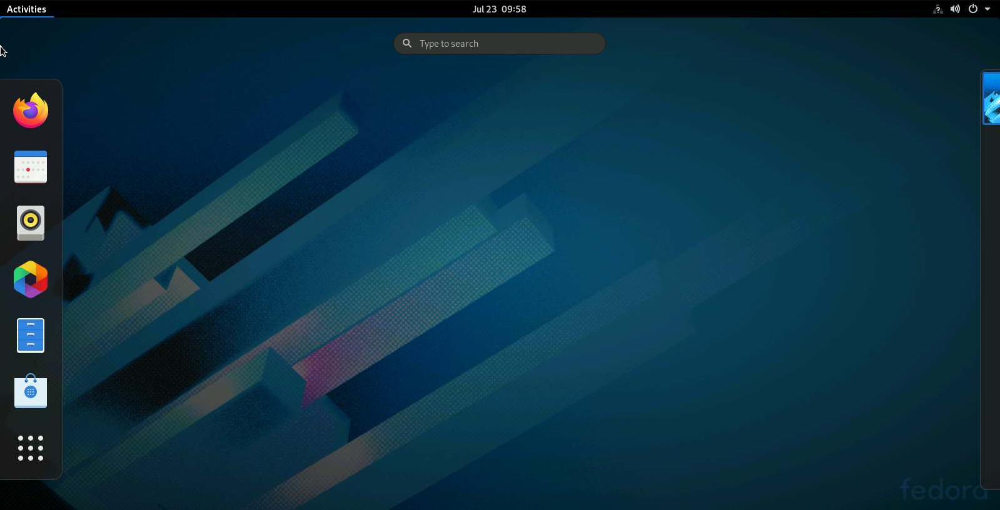

.. -*- coding: utf-8 -*-
.. Copyright |copy| 2021 by François De Keersmaeker
.. Ce fichier est distribué sous une licence `creative commons <http://creativecommons.org/licenses/by-sa/3.0/>`_

.. _linux:

Disposer d'une machine Linux
----------------------------
.. sectionauthor:: François De Keersmaeker

Pour les cours LEPL1503 et LINFO1252, chaque étudiant doit avoir accès à une machine
tournant sous un système d'exploitation Linux.
Ceci est nécessaire pour les exercices et projets de ces cours,
qui utilisent le langage C,
et savoir utiliser une machine Linux, notamment en ligne de commande,
est un acquis d'apprentissage.
Ce document va donc détailler 4 manières d'avoir accès à une machine Linux,
chacune avec un niveau différent de compromis entre facilité d'installation
et confort d'utilisation.
Ces 4 possibilités sont les suivantes, depuis la plus simple d'installation
(mais la moins confortable d'utilisation) à la plus complexe:
  * Accéder à l'image d'une machine des salles informatiques de l'université depuis le navigateur.
  * Utiliser Windows Subsystem for Linux
  * Installer une machine virtuelle Linux
  * Installer un dual-boot Linux

Ces solutions sont toutes possibles pour un ordinateur utilisant Windows,
mais seules les première et troisième sont disponibles pour MacOS (du moins, de manière simple).

Accéder à UDS depuis le navigateur
~~~~~~~~~~~~~~~~~~~~~~~~~~~~~~~~~~

UDS est un service en ligne proposé par l'université,
qui permet d'accéder, grâce à une connexion internet,
à une machine équivalente à celles des machines Linux des salles informatiques,
depuis son navigateur.
Cette solution a l'avantage de ne nécessiter aucune installation,
mais elle nécessite une bonne connexion Internet pour tourner de manière stable
et fluide.
Elle est donc conseillée pour les étudiants ayant une bonne connexion Internet.
Pour les autres, les solutions suivantes sont plus indiquées.

Pour accéder à UDS, commençons par se rendre sur l'URL https://uds.siws.ucl.ac.be.
Connectez-vous en indiquant votre **adresse email UCLouvain**, et votre mot de passe:

.. figure:: ./figures/linux/uds/uds_connection.png
  :align: center
  :scale: 100

  Page de connexion d'UDS

Ensuite, sélectionnez la machine Didac-ingi (pas Didac-Générique !):

.. figure:: ./figures/linux/uds/uds_choice.png
  :align: center
  :scale: 100

  Choix de la machine UDS

Connectez-vous à la machine en indiquant votre **identifiant UCLouvain** (pas l'adresse email !)
et votre mot de passe:

.. figure:: ./figures/linux/uds/uds_connection_vm.png
  :align: center
  :scale: 100

  Connexion à la machine UDS

Vous avez désormais accès à une machine Linux (pour être plus précis, Fedora) !

  Machine Linux (Fedora) depuis le navigateur

.. note:: Sauvegarder des fichiers sur UDS

  Lorsqu'on utilise UDS, la machine est réinitialisée entre chaque connexion.
  Cela signifie qu'à chaque connexion, la machine est remise à son état initial,
  et tous les fichiers créés sont supprimés.
  Pour sauvegarder les fichiers, il faut donc les enregistrer sur son espace
  personnel UCLouvain.
  Cet espace est disponible depuis toutes les machines de l'UCLouvain,
  et son contenu est sauvegardé entre chaque connexion.
  Il se trouve à l'emplacement ``/home/user/oasis`` sur UDS.

  .. figure:: ./figures/linux/uds/uds_oasis.png
    :align: center
    :scale: 100

    Dossier ``oasis``

Utiliser Windows Subsystem for Linux
~~~~~~~~~~~~~~~~~~~~~~~~~~~~~~~~~~~~

Sur les ordinateurs Windows, il existe un moyen d'obtenir un terminal Linux
léger, sur lequel on peut exécuter des commandes bash comme sur une machine Linux classique.
Ce terminal, qui s'appelle Windows Subsystem for Linux (WSL),
ne propose cependant pas d'interface graphique,
on ne peut donc interagir qu'en ligne de commande.
Cela peut rebuter certains utilisateurs, mais cela permet d'avoir un système
très léger et donc très rapide, et dont l'installation est très facile.
De plus, cette solution ne fonctionne que sur les machines Windows.
Les instructions d'installation mentionnées ci-après proviennent de
https://lecrabeinfo.net/installer-wsl-windows-subsystem-for-linux-sur-windows-10.html

Pour installer WSL, il faut d'abord activer la fonctionnalité dans les paramètres Windows.
Pour ce faire, commencez par ouvrir l'outil *Fonctionnalités de Windows*, depuis
*Paramètres* > *Applications* > *Applications et fonctionnalités* >
*Fonctionnalités facultatives* > *Plus de fonctionnalités Windows*.
Cochez la case "Sous-système Windows pour Linux" puis cliquez sur *OK*.
Vous devrez redémarrer pour finaliser l'installation de la fonctionnalité.

Il est également recommandé de définir WSL 2 comme version par défaut.
Pour ce faire, dans PowerShell, entrez la commande suivante:

.. code-block:: shell

  PS > wsl --set-default-version 2

Il ne reste plus qu'à installer la distribution Linux voulue
depuis le Windows Store.
Il est conseillé de choisir "Ubuntu", car c'est une distribution de Linux très répandue
et facile d'utilisation.
Depuis le Windows Store, rechercher "Ubuntu", et l'installer.

.. figure:: ./figures/linux/wsl/store.png
  :align: center
  :scale: 100

  Application "Ubuntu" depuis le Windows Store

Une fois l'installation de l'application terminée, Ubuntu doit encore installer toutes les librairies nécessaires,
et ne peut donc pas être utilisé directement. Un peu de patience !

Une fois l'installation réellement terminée, vous aurez accès à un terminal Ubuntu,
comme si vous étiez sur une machine Linux.
Toutes les commandes bash vous seront donc accessibles, notamment
les commandes de gestion des dossiers et de compilation de programmes C.

.. note:: Accéder aux fichiers de Windows depuis WSL

Lorsqu'on utilise WSL, il n'y a pas d'interface graphique pour, par exemple,
utiliser un éditeur de texte tel que Atom pour coder.
On peut cependant produire les fichiers textes nécessaires depuis Windows directement,
puis y accéder depuis WSL pour la compilation et l'exécution.
Or, puisque WSL possède son propre système de fichiers Linux,
il faut donc creuser un peu pour retrouver les fichiers Windows.
Les disques Windows sont accessibles depuis le dossier ``/mnt``, suivi de la lettre du disque.
Par exemple, le disque C est accessible depuis ``/mnt/c``.
Depuis ces disques, vous pouvez retrouver tous les fichiers disponibles sur Windows.
Pour plus de facilité, il est conseillé de créer un raccourci depuis le dossier d'accueil de WSL
vers les dossiers Windows désirés.
Pour ce faire, on utilise la commande `ln(1)`_:

.. code-block:: bash

  $ ln -s TARGET_FILE LINK_NAME

Dans ce cas, ``TARGET_FILE`` sera le fichier ou dossier Windows voulu (accessible à partir de ``/mnt``),
et ``LINK_NAME`` sera l'emplacement voulu du raccourci (pour le mettre sur le dossier d'accueil
de WSL, ce sera ``~/target_file``).

Machine virtuelle Linux
~~~~~~~~~~~~~~~~~~~~~~~

Une des façons les plus populaires d'avoir accès à une autre machine depuis sa propre machine,
est d'utiliser une `machine virtuelle <https://fr.wikipedia.org/wiki/Machine_virtuelle>`_,
ou VM (pour *virtual machine*).
Il s'agit d'une machine émulée, grâce à un logiciel dédié, sur une machine physique.
Cela permet d'avoir accès à certains systèmes d'exploitations ou certaines machines
sans devoir les installer de manière physique.
Ce genre d'installation est donc plus facile, mais puisque la machine est émulée,
la performance est moins élevée.
Il s'agit d'un bon compromis entre performance et facilité d'installation,
si on ne veut pas installer complètement un nouveau système d'exploitation sur sa machine.

Pour disposer d'une machine virtuelle, il faut tout d'abord obtenir le logiciel d'émulation.
Le plus populaire est `VirtualBox <https://www.virtualbox.org/>`_.
Il est open-source, et disponible sur Windows et MacOS.
La première étape est donc d'aller sur la page *Downloads* du site de VirtualBox, puis
de télécharger et installer la dernière version du logiciel.
Ensuite, sur la même page, il faut télécharger le *VirtualBox Extension Pack*,
qui permet d'étendre les capacités des VMs, et sera nécessaire pour celle que nous utiliserons.
Une fois téléchargé, il suffit de double-cliquer sur le fichier,
pour que VirtualBox l'installe automatiquement.
Plus d'informations sur l'installation de VirtualBox sont disponibles à l'adresse suivante:
https://wiki.student.info.ucl.ac.be/Logiciels/VirtualBox.

La prochaine étape est de télécharger la machine virtuelle en elle-même.
Nous fournissons l'image des machines Fedora disponibles en salles informatiques,
qui peut être installée sur VirtualBox.
Cette image est la même que celle accessible via UDS, comme décrit plus tôt.
Elle peut être téléchargée avec le lien suivant:
https://wiki.student.info.ucl.ac.be/uploads/Mat%c3%a9riel/Mat%c3%a9riel/fedora32.ova
(Attention, le fichier fait plus de 5 GB !).
Une fois téléchargée, il suffit de double-cliquer sur le fichier,
et VirtualBox ouvrira le fichier pour l'installation.
Sur la fenêtre s'étant ouverte, les paramètres de base peuvent être laissés.
Cliquez sur *Importer* pour créer la machine virtuelle.
La procédure d'importation prend un certain temps, patience !

.. figure:: ./figures/linux/vm/install_vm.png
  :align: center
  :scale: 100

  Importation d'une VM dans VirtualBox

Une fois que la VM est importée, démarrez la.
Sur l'écran noir vous demandant de choisir entre 2 versions de Fedora, choisissez la première.
Ensuite, sélectionnez l'utilisateur "Tux", qui est l'utilisateur par défaut.
Vous avez désormais une machine virtuelle Linux fonctionnelle, à l'intérieur de votre
machine !

Dual-boot Linux
~~~~~~~~~~~~~~~

La dernière option, qui est la plus radicale, est d'installer directement Linux
en tant que système d'exploitation sur sa machine, de manière à pouvoir
choisir au démarrage entre le système d'exploitation natif et Linux.
Ceci s'appelle un *dual-boot*, car on a le choix entre deux systèmes d'exploitation (*dual*)
lors du démarrage (*boot*).
Cette possibilité est la plus compliquée en terme d'installation, mais permet
le plus de confort d'utilisation et de performance une fois l'installation effectuée.
Elle est conseillée pour les étudiants en filière informatique
(car Linux pourra être utilisé par la suite dans d'autres cours),
mais peut sembler trop lourde pour les étudiants qui n'utiliseront Linux
que pour le cours LEPL1503.

Il existe de nombreuses manières d'installer un dual-boot sur sa machine.
Le kot à projet `Louvain-li-Nux <https://www.louvainlinux.org/>`_ propose généralement
une "Install Party", où ils peuvent vous aider à installer Linux en dual-boot.
De nombreux tutoriels sont également disponibles en ligne.
L'installation dépend évidemment de la version de Linux que vous souhaitez.
Un tutoriel pour l'installation d'Ubuntu, qui est une des versions les plus populaires de Linux,
est disponible à l'URL
https://lecrabeinfo.net/installer-ubuntu-20-04-lts-le-guide-complet.html.
Pour Fedora, la version de Linux disponible sur les machines des salles informatiques
(et sur UDS, comme expliqué précedemment), un tutoriel est disponible à l'URL
https://www.tecmint.com/install-fedora-with-windows-dual-boot/.
