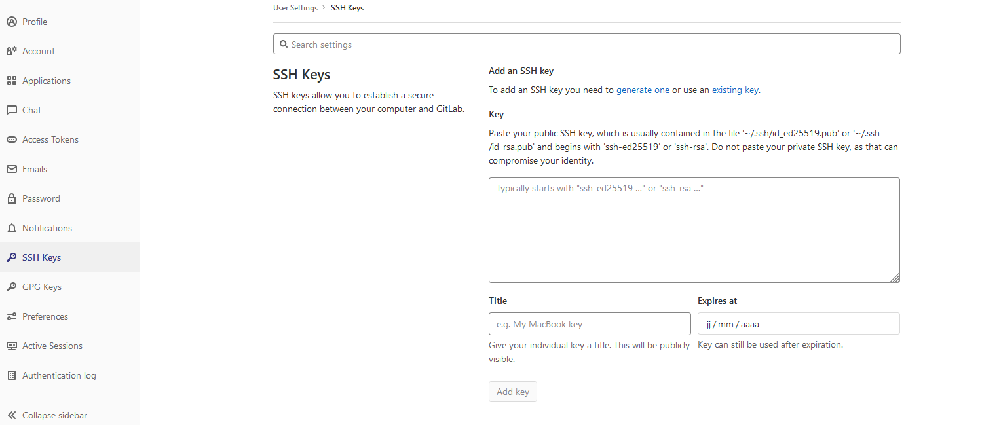

.. -*- coding: utf-8 -*-
.. Copyright |copy| 2012 by `Olivier Bonaventure <https://inl.info.ucl.ac.be/obo>`_, Christoph Paasch, Grégory Detal et Maxime De Mol
.. Ce fichier est distribué sous une licence `creative commons <https://creativecommons.org/licenses/by-sa/3.0/>`_

.. _outils:ssh:

SSH
---

.. spelling:word-list::

   ssh
   intel
   sirius
   l'Internet
   Secure
   Shell
   push

`ssh(1)`_ (Secure Shell) est un outil qui permet de se connecter depuis l'Internet à la console d'une autre machine et donc d'y exécuter des commandes. Dans l'infrastructure INGI vous pouvez vous connecter via ssh aux différents machines des salles en utilisant votre login et mot de passe INGI. Pour savoir les noms de machines, visitez le `student-wiki <https://wiki.student.info.ucl.ac.be/Mat%C3%A9riel/Mat%C3%A9riel>`_.

Depuis l'extérieur vous devez passer via ``studssh.info.ucl.ac.be`` pour ensuite pouvoir vous connecter sur les machines des salles.

Quelques exemples d'utilisation de `ssh(1)`_ qui vous seront utiles:

	* ``ssh [username]@[hostname]``: Avec ceci vous pouvez vous connecter à la machine ``hostname``. Exemple: ``ssh myUserName@yunaska.info.ucl.ac.be`` pour vous connecter à la machine ``yunaska`` de la salle intel. Il faut d'abord se connecter à sirius avant de se connecter aux machines des salles.
	* ``ssh -X [username]@[hostname]``: L'option ``-X`` vous permet d'exécuter des programmes sur la machine distante mais en voyant l'interface graphique en local sur votre machine (pour autant qu'elle supporte :term:`X11`). Exemple: ``ssh -X myUserName@yunaska.info.ucl.ac.be`` et ensuite dans le terminal ``gedit test.c`` pour ouvrir l'éditeur de texte.
	* ``ssh [username]@[hostname] [commande]``: Pour exécuter la commande sur la machine distante. Exemple: ``ssh myUserName@sirius.info.ucl.ac.be cc test.c -o test`` pour exécuter ``cc test.c -o test`` sur sirius.
	* ``scp [local_file] [username]@[hostname]:[path]``: `scp(1)`_ permet de copier des fichiers locaux vers un répertoire distant (et l'inverse). Exemple: ``scp test.c myUserName@sirius.info.ucl.ac.be:INFO1252/projet_S2/`` copie test.c vers le dossier ``INFO1252/projet_S2/`` de la machine sirius.

Le site `Getting started with SSH <https://developer.ibm.com/articles/au-sshsecurity/>`_ contient une bonne description de l'utilisation de ssh. Notamment l'utilisation de ssh sur des machines UNIX/Linux. Si vous utilisez Windows, il existe des clients `ssh(1)`_ comme `putty <https://www.putty.org/>`_

Authentification par clé
^^^^^^^^^^^^^^^^^^^^^^^^

Face à la faiblesse au niveau sécurité de l'authentification par mot de passe, l'authentification par clé se révèle être un moyen nettement plus efficace.

L'authentification par clé consiste en un premier temps à générer une paire de clés et son mot de passe:

    * La *clé publique* que l'on exporte vers chaque hôte sur lequel on veut se connecter.
    * La *clé privée* que l'on garde précieusement sur notre ordinateur, et qui sert à prouver à l'hôte notre identité. **Attention: ne jamais dévoiler sa clé privée !**
    * Le *mot de passe* permet de sécuriser sa clé privée.

Le mot de passe ne servant à rien sans les clé et vice versa, on devine aisément que le niveau de sécurité d'une telle connexion est largement accru par rapport à une simple authentification par mot de passe.

Pour générer ces clés et choisir votre mot de passe, il suffit d'entrer la commande

    .. code-block:: none

      $ ssh-keygen -t rsa -C "login"
      # remplacer "login" par votre nom d'utilisateur

      Generating public/private rsa key pair.
      Enter file in which to save the key (~/.ssh/id_rsa):
      Enter passphrase (empty for no passphrase):
      Enter same passphrase again:
      Your identification has been saved in ~/.ssh/id_rsa.
      Your public key has been saved in ~/.ssh/id_rsa.pub.
      The key fingerprint is:
      17:bc:98:ab:39:f6:a2:db:1d:07:9a:63:d7:c7:9b:e0 "login"

Maintenant que les clés ont été crées, il faut communiquer votre clé publique à l'hôte sur lequel vous voulez vous connecter. Pour cela, le plus simple est d'utiliser la commande suivante

    .. code-block:: console

      $ cat ~/.ssh/id_rsa.pub | ssh [username]@[hostname] "cat - >> ~/.ssh/authorized_keys"

Cette commande va récupérer votre clé publique dans votre dossier ``~/.ssh``, se connecter en ssh à l'hôte et va placer votre clé dans son répertoire de clés autorisées. Maintenant nous pouvons utilisez en toute sérénité votre connexion ssh sécurisée!

Petit mot sur les permissions du dossier ``~/.ssh`` où sont stockées les clés:

    .. code-block:: console

      .ssh user$ ls -ld
      drwx------  6 user  staff  204 22 aoû 10:29 .

Les bits de permissions sont définis comme ``drwx------`` ce qui fait du propriétaire de ce dossier la seul personne capable de lire, d'écrire et d'exécuter le contenu de se dossier. La clé privée est donc belle et bien privée!

Utiliser Git avec ssh
^^^^^^^^^^^^^^^^^^^^^

Il est également possible de s'authentifier auprès de Git en utilisant une clé ssh à la place de la traditionnelle combinaison nom d'utilisateur et mot de passe.
L'avantage de ceci est qu'il n'est plus nécessaire de fournir ses identifiants à chaque push ou pull.
L'identité est directement vérifiée depuis les clés ssh présentes sur la machine.

Pour activer l'identification avec ssh, il faut fournir sa clé publique sur la plateforme en ligne utilisée avec Git, par exemple GitHub ou GitLab.
Pour ce faire, il suffit de suivre les étapes suivantes:

				* Ouvrir les paramètres du profil.
				* Ouvrir la page de gestion des clés SSH.
					Sur GitLab, il s'agit de ``SSH Keys``.
					Sur GitHub, il s'agit de ``SSH and GPG keys``.
				* Copier la clé publique à l'endroit indiqué. **Attention à ne pas copier la clé privée !**
					La clé publique se trouve généralement dans le fichier ``~/.ssh/id_rsa.pub``.
					Il faut copier tout le contenu de ce fichier pour que la clé soit correcte.
				* Donner un titre à la clé, qui permet d'identifier la clé parmi plusieurs sur la plateforme.
				* Finaliser en ajoutant la clé.

A titre d'exemple, voici la page permettant d'ajouter une clé SSH sur GitLab:

Une fois que la clé publique est ajoutée sur son profil, il est possible d'utiliser ssh pour s'identifier auprès de Git.
Pour ce faire, lorsqu'un projet est cloné depuis la plateforme (GitHub ou GitLab),
il faut choisir le lien ``Clone with SSH``.
De cette manière, c'est la clé ssh qui sera utilisée pour s'identifier,
et il ne faudra plus indiquer le nom d'utilisateur et le mot de passe à chaque opération.

Synchronisation de fichiers entre ordinateurs
^^^^^^^^^^^^^^^^^^^^^^^^^^^^^^^^^^^^^^^^^^^^^

Quand nous avons besoin de synchroniser des fichiers entre 2 ordinateurs différents, Unix nous vient en aide avec l'utilitaire `rsync <https://www.lifewire.com/copying-directories-with-rsync-3971105>`_.

L'utilisation la plus basique de `rsync <https://www.lifewire.com/copying-directories-with-rsync-3971105>`_ est:

    .. code-block:: console

      rsync *.c [hostname]:src/

`rsync <https://www.lifewire.com/copying-directories-with-rsync-3971105>`_ va copier tout les fichiers qui correspondent au pattern ``*.c`` du répertoire courant vers le dossier ``src/`` sur la machine hôte. De plus, si certains ou tout les fichiers sont déjà présents chez l'hôte, `rsync <https://www.lifewire.com/copying-directories-with-rsync-3971105>`_ va procéder à une mise à jour différentielle de ces fichiers (seuls les changements sont transférés).

L'ajout du drapeau ``-avz`` permet de synchroniser les fichiers en mode archive. Cela veut dire que tous les liens, permissions, propriétaires, etc de ces fichiers seront préservés durant le transfert.

Nous pouvons aussi utiliser `rsync <https://www.lifewire.com/copying-directories-with-rsync-3971105>`_ dans l'autre sens:

    .. code-block:: console

      rsync -avz [hostname]:src/bar /data/tmp

Maintenant tous les fichiers de la machine hôte, dans le dossier ``src/bar`` vont être copiés vers le répertoire local ``/data/tmp``.

.. spelling:word-list::

   src
